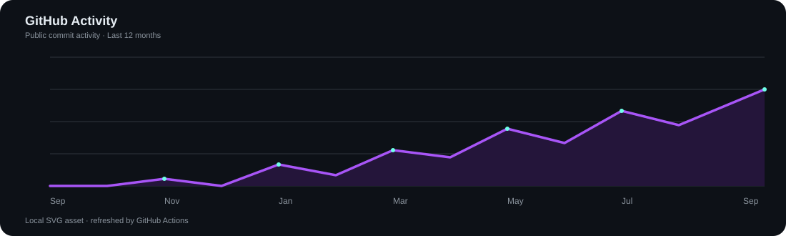
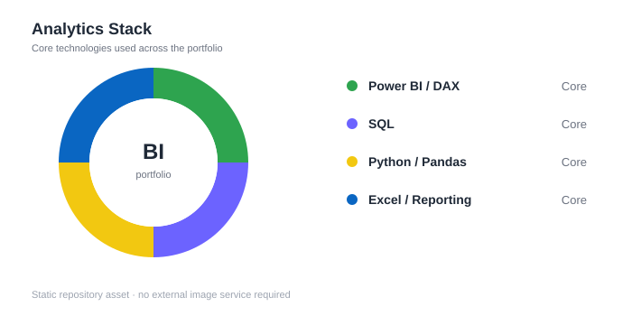

 

 

## 👋 About Me

I am a **Management Information Systems (MIS) graduate** focused on **Data Analytics, Business Intelligence, and business reporting**.

I turn raw data into structured analysis, clear dashboards, and practical insights — with an emphasis on **accuracy, readability, and business context**.

**Target roles:** `Junior Data Analyst` · `BI Analyst` · `Data Reporting Analyst` · `Business Analyst`

---

## 🧭 What I Build

<table>
<tr>
<td width="33%" align="center" valign="top">

### 📊 Dashboards

Interactive **Power BI** dashboards with KPI monitoring, trend analysis, filters, and business-focused storytelling.

</td>
<td width="33%" align="center" valign="top">

### 🔎 Data Analysis

Data cleaning, validation, aggregation, and analysis using **SQL, Python, Pandas, and Excel**.

</td>
<td width="33%" align="center" valign="top">

### 📈 Reporting

Clear reporting structures that connect operational metrics with **performance and business decisions**.

</td>
</tr>
</table>

---

## 🧰 Analytics Stack

### Business Intelligence

### Data & Programming

### Visualization

---

## ⭐ Featured Project

<table>
<tr>
<td width="100%" valign="top">

### 📞 Call Center Performance Dashboard

A **Power BI operational analytics project** focused on call volume, agent performance, service level, abandonment, answer speed, and forecast accuracy.

**Stack:** `Power BI` · `DAX` · `Power Query` · `Data Modeling` · `Deneb / Vega-Lite`

**Demonstrates:** KPI design, business analysis, time-based comparisons, agent analytics, and decision-ready reporting.

 

</td>
</tr>
</table>

---

## 🔄 Analytics Workflow

<table>
<tr>
<td align="center">01 <b>QUESTION</b></td>
<td>→</td>
<td align="center">02 <b>PREPARE</b></td>
<td>→</td>
<td align="center">03 <b>VALIDATE</b></td>
<td>→</td>
<td align="center">04 <b>ANALYZE</b></td>
<td>→</td>
<td align="center">05 <b>VISUALIZE</b></td>
<td>→</td>
<td align="center">06 <b>INSIGHT</b></td>
</tr>
</table>

---

## 📈 GitHub Analytics

  

 

> **Analytics are hosted directly in this repository, so the charts do not depend on external GitHub stats services.**

---

## 📚 Current Focus

<table>
<tr>
<td align="center" width="20%">

 <b>Advanced DAX</b>
</td>
<td align="center" width="20%">

 <b>Analysis</b>
</td>
<td align="center" width="20%">

 <b>Pandas & NumPy</b>
</td>
<td align="center" width="20%">

 <b>Reporting</b>
</td>
<td align="center" width="20%">

 <b>Data Engineering</b>
</td>
</tr>
</table>

---

## 💻 Tools in Symbols

  

---

## 🎯 Career Direction

I am building a career in **Data Analytics and Business Intelligence**, with a focus on transforming operational data into reliable reporting, performance analysis, and decision support.

> **Build with data. Explain with visuals. Decide with insight.**

---

### 🤝 Let's Connect

  

Thanks for visiting my profile.

<!-- Profile README by Omar Al-Dahleh -->
